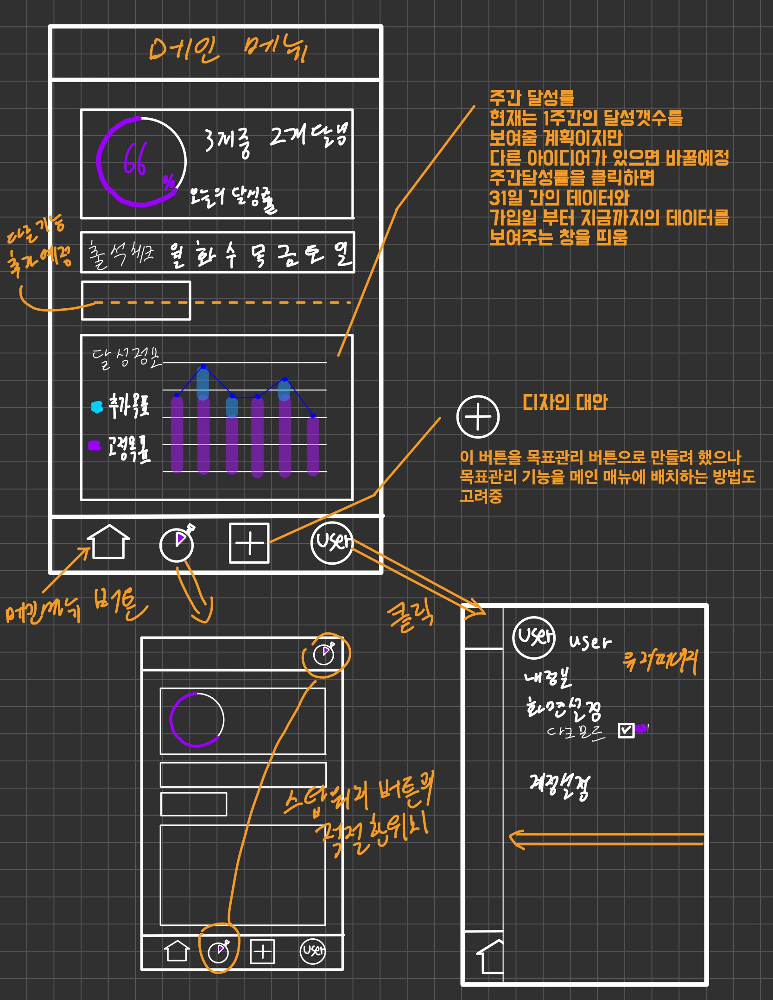
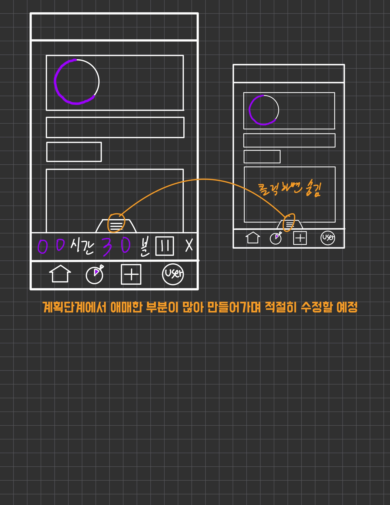

# TODO LIST 2.0

This template provides a minimal setup to get React working in Vite with HMR and some ESLint rules.

Currently, two official plugins are available:
<p display='flex'>
    
    
</p>


```
    
```

# WHAT I NEED TO DO

user data modify

make task data

adjust account components

make a decision on the design of the MAIN page


- [@vitejs/plugin-react](https://github.com/vitejs/vite-plugin-react/blob/main/packages/plugin-react/README.md) uses [Babel](https://babeljs.io/) for Fast Refresh
- [@vitejs/plugin-react-swc](https://github.com/vitejs/vite-plugin-react-swc) uses [SWC](https://swc.rs/) for Fast Refresh
